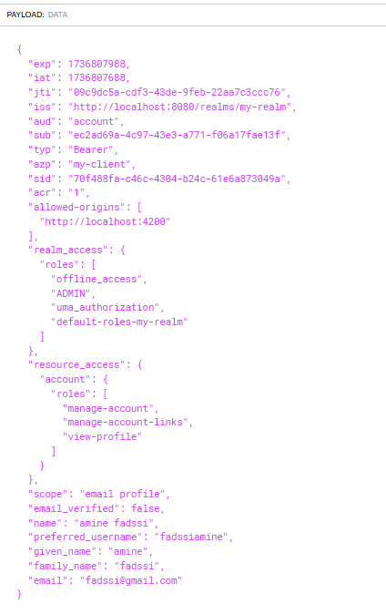

# Spring-Angular-keycloak

## Keycloak setup

### docker-compose file

```yaml

services:
  postgres:
    image: postgres:16.2
    container_name: postgres
    hostname: postgres
    volumes:
      - postgres_data:/var/lib/postgresql/data
    env_file:
      - ./init.Ini
    networks:
      - keycloak_network

  keycloak:
    image: quay.io/keycloak/keycloak:26.0.7
    container_name: keycloak
    hostname: keycloak
    command: start-dev
    env_file:
      - ./init.Ini
    ports:
      - 8080:8080
    restart: always
    depends_on:
      - postgres
    networks:
      - keycloak_network

volumes:
  postgres_data:
    driver: local

networks:
  keycloak_network:
    driver: bridge
```

### Start keycloak


### keycloak interface

#### Admin Login page


#### Create realm (my-realm)

Create realm called: `my-realm`:


#### Create client to secure (my-client)

Create client called: `my-client`:


configure `authentication methods`:


Configure `redirect` urls and `cors`:


#### Create roles (USER and ADMIN roles)


##### create USER role


##### create ADMIN role


##### Realm role list


#### Create users

##### Create first user


##### Create second user


#### User list


#### roles assignment

Assign role `USER` to `hajjimohammed` user:


Assign role `ADMIN` to `fadssiamine` user:


### Test with Postman


#### Setting content-type header


#### Password authentication

For user: `hajjimohammed`:


For user: `fadssiamine`:


#### Access token and refresh token content

##### Access token





##### Refresh token


#### Refresh token authentication


#### Client secret authentication

##### Enable client authentication


##### Get client secret appropriate to my-client


##### Client secret auth


### modify tokens properties

modify signature algorithm from `RSA` to `EDSA`:


modify lifespan of access token:


After modification, we got:


## Backend: Inventory-service


### Dependencies

Dependencies used for this microservice are:

- `Spring data JPa`
- `Spring web`
- `H2 database`
- `oauth2 resource server`
- `Eureka discorvery client`
- `Config client`
- `Lombok`


### application.yml file

```yaml
spring:
  application:
    name: inventory-service

  datasource:
    url: jdbc:h2:mem:inventory-db


  h2:
    console:
      enabled: true

  cloud:
    config:
      enabled: false

    discovery:
      enabled: false


  security:
    oauth2:
      resourceserver:
        jwt:
          issuer-uri: http://localhost:8080/realms/my-realm
          jwk-set-uri: http://localhost:8080/realms/my-realm/protocol/openid-connect/certs
server:
  port: 9090


```


### Entities

#### Product entity

```java
package md.hajji.inventoryservice.entities;


import jakarta.persistence.Entity;
import jakarta.persistence.Id;
import lombok.*;
import org.hibernate.annotations.UuidGenerator;

@Entity
@Getter @Setter @AllArgsConstructor @NoArgsConstructor @Builder
@ToString
public class Product {
    @Id
    @UuidGenerator(style = UuidGenerator.Style.TIME)
    private String id;
    private String name;
    private double price;
    private int quantity;
}

```
### Repositories

#### ProductRepository

```java
package md.hajji.inventoryservice.repositories;

import md.hajji.inventoryservice.entities.Product;
import org.springframework.data.jpa.repository.JpaRepository;

public interface ProductRepository extends JpaRepository<Product, String> {
}

```

### Web

#### ProductRestController

```java
package md.hajji.inventoryservice.web;


import lombok.Getter;
import lombok.RequiredArgsConstructor;
import md.hajji.inventoryservice.exceptions.ProductNotFoundException;
import md.hajji.inventoryservice.repositories.ProductRepository;
import org.springframework.http.ResponseEntity;
import org.springframework.web.bind.annotation.GetMapping;
import org.springframework.web.bind.annotation.PathVariable;
import org.springframework.web.bind.annotation.RequestMapping;
import org.springframework.web.bind.annotation.RestController;

@RestController
@RequestMapping(path = "/products")
@RequiredArgsConstructor
public class ProductRestController {


    private final ProductRepository productRepository;


    @GetMapping
    public ResponseEntity<?> getAll(){
        return ResponseEntity.ok(productRepository.findAll());
    }

    @GetMapping(path = "{id}")
    public ResponseEntity<?> get(@PathVariable String id){
        return ResponseEntity.ok(
                productRepository.findById(id)
                        .orElseThrow(() ->  new ProductNotFoundException(id))
        );
    }

}

```


### Exceptions

#### ProductNotFoundException

```java
package md.hajji.inventoryservice.exceptions;

public class ProductNotFoundException extends RuntimeException {
    public ProductNotFoundException(String id) {
        super("Product with id " + id + " not found");
    }
}

```

#### ExceptionsHandler

```java
package md.hajji.inventoryservice.exceptions;


import org.springframework.http.HttpStatus;
import org.springframework.http.ResponseEntity;
import org.springframework.web.bind.annotation.ControllerAdvice;
import org.springframework.web.bind.annotation.ExceptionHandler;

@ControllerAdvice
public class ExceptionsHandler {


    @ExceptionHandler({ProductNotFoundException.class})
    public ResponseEntity<String> handleProductNotFoundException(ProductNotFoundException exception) {
        return ResponseEntity.status(HttpStatus.NOT_FOUND)
                .body(exception.getMessage());
    }
}

```

### Security

#### SecurityConfiguration


```java
package md.hajji.inventoryservice.security;


import lombok.SneakyThrows;
import org.springframework.context.annotation.Bean;
import org.springframework.context.annotation.Configuration;
import org.springframework.security.config.Customizer;
import org.springframework.security.config.annotation.web.builders.HttpSecurity;
import org.springframework.security.config.annotation.web.configuration.EnableWebSecurity;
import org.springframework.security.config.annotation.web.configurers.AbstractHttpConfigurer;
import org.springframework.security.config.http.SessionCreationPolicy;
import org.springframework.security.web.SecurityFilterChain;

@Configuration
@EnableWebSecurity
public class SecurityConfiguration {

    @Bean
    @SneakyThrows({Exception.class})
    public SecurityFilterChain securityFilterChain(HttpSecurity http){

        return http
                .authorizeHttpRequests(auth -> auth.requestMatchers("/products/**").permitAll())
                .sessionManagement(session -> session.sessionCreationPolicy(SessionCreationPolicy.STATELESS))
                .csrf(AbstractHttpConfigurer::disable)
                .oauth2ResourceServer(oauth2 -> oauth2.jwt(Customizer.withDefaults()))
                .build();

    }


}

```

At this point, we don't have any kind of security because we `permit` all request to `/products` endpoint.

Later we will update this class to ensure security using `keycloak`.

### Utils

#### ProductFactory

```java
package md.hajji.inventoryservice.utils;

import md.hajji.inventoryservice.entities.Product;

import java.util.ArrayList;
import java.util.List;
import java.util.Random;

public class ProductFactory {

    static final List<String> NAMES = List.of("Pixel 6a", "Pixel 8", "Samsung S25", "Iphone 16 pro");
    static final List<Double> PRICE_SEEDS = List.of(3500., 4700., 4500., 8000.);
    static final Random RANDOM = new Random();


    public static Product randomProduct() {
        var index = RANDOM.nextInt(PRICE_SEEDS.size());
        return Product.builder()
                .name(NAMES.get(index))
                .price(RANDOM.nextDouble(PRICE_SEEDS.get(index)))
                .quantity(RANDOM.nextInt(20))
                .build();
    }

}
```

### First Test

```java
package md.hajji.inventoryservice;

import md.hajji.inventoryservice.repositories.ProductRepository;
import md.hajji.inventoryservice.utils.ProductFactory;
import org.springframework.boot.CommandLineRunner;
import org.springframework.boot.SpringApplication;
import org.springframework.boot.autoconfigure.SpringBootApplication;
import org.springframework.context.annotation.Bean;

import java.util.stream.Stream;

@SpringBootApplication
public class InventoryServiceApplication {

    public static void main(String[] args) {
        SpringApplication.run(InventoryServiceApplication.class, args);
    }


    @Bean
    CommandLineRunner start(ProductRepository productRepository) {
        return args -> {
            Stream.generate(ProductFactory::randomProduct)
                    .limit(10)
                    .forEach(productRepository::save);
        };
    }

}

```

And we got the following results:


### Enable requests authentication

Now we are going to enable authentication for all request to our base url: `http://localhost:9090/`.
the changes that should we made are:

- `update SecurityFilterChain bean`: by ensuring that any request should be authenticated.
- `update application.yml file`: add properties like `authorities-claim-name` to tell JWT converter where its will find the authorities in the JWT token, and also set `authority-prefix` to `ROLE_`
- `set claim that will contains roles`: in keyloack we need to set the claim that will include user roles, instead of having roles in `realm_access.roles` claim.


#### Update SecurityFilterChain bean


```java
package md.hajji.inventoryservice.security;


import lombok.SneakyThrows;
import org.springframework.context.annotation.Bean;
import org.springframework.context.annotation.Configuration;
import org.springframework.security.config.Customizer;
import org.springframework.security.config.annotation.web.builders.HttpSecurity;
import org.springframework.security.config.annotation.web.configuration.EnableWebSecurity;
import org.springframework.security.config.annotation.web.configurers.AbstractHttpConfigurer;
import org.springframework.security.config.http.SessionCreationPolicy;
import org.springframework.security.oauth2.server.resource.authentication.JwtAuthenticationConverter;
import org.springframework.security.web.SecurityFilterChain;

@Configuration
@EnableWebSecurity
public class SecurityConfiguration {

    @Bean
    @SneakyThrows({Exception.class})
    public SecurityFilterChain securityFilterChain(HttpSecurity http, JwtAuthenticationConverter jwtAuthenticationConverter){

        return http
                .authorizeHttpRequests(auth -> auth.anyRequest().authenticated())
                .sessionManagement(session -> session.sessionCreationPolicy(SessionCreationPolicy.STATELESS))
                .csrf(AbstractHttpConfigurer::disable)
                .oauth2ResourceServer(oauth -> oauth.jwt(Customizer.withDefaults()))
                .build();

    }

}

```


#### Update application.yml file

```yaml
spring:
  application:
    name: inventory-service

  datasource:
    url: jdbc:h2:mem:inventory-db


  h2:
    console:
      enabled: true

  cloud:
    config:
      enabled: false

    discovery:
      enabled: false


  security:
    oauth2:
      resourceserver:
        jwt:
          issuer-uri: http://localhost:8080/realms/my-realm
          jwk-set-uri: http://localhost:8080/realms/my-realm/protocol/openid-connect/certs

          # set authority claim, so default converter can access to it:
          authorities-claim-name: authorities
          # add a special prefix to parsed roles:
          authority-prefix: ROLE_
server:
  port: 9090
```

#### Set claim that will contain roles


In the Payload of generated JWT for `hajjimohammed` user, we can see that roles are included in `authorities` claim:


#### Test /products endpoint with enabled security


## Front-End with Angular

after adding angular-keycloak and keycloak-js using:
```shell
npm install angular-keycloak@15 keycloak-js@20
```
We can easily set up our keycloak adapter:


### Keycloak initialization

```typescript
import {APP_INITIALIZER, NgModule} from '@angular/core';
import { BrowserModule } from '@angular/platform-browser';

import { AppRoutingModule } from './app-routing.module';
import { AppComponent } from './app.component';
import {KeycloakService} from "keycloak-angular";
import { ProductsComponent } from './ui/products/products.component';


function initializeKeycloak(keycloak: KeycloakService) {
  return () =>
    keycloak.init({
      config: {
        url: 'http://localhost:8080',
        realm: 'my-realm',
        clientId: 'my-client'
      },
      initOptions: {
        onLoad: 'check-sso',
        silentCheckSsoRedirectUri:
          window.location.origin + '/assets/silent-check-sso.html'
      }
    });
}


@NgModule({
  declarations: [
    AppComponent,
    ProductsComponent,
  ],
  imports: [
    BrowserModule,
    AppRoutingModule
  ],
  providers: [
    KeycloakService,
    {
      provide: APP_INITIALIZER,
      useFactory: initializeKeycloak,
      multi: true,
      deps: [KeycloakService]
    }
  ],
  bootstrap: [AppComponent]
})
export class AppModule { }

```

#### silent-check-sso.html file

```html
<html>
  <body>
    <script>
      parent.postMessage(location.href, location.origin);
    </script>
  </body>
</html>

```


### AuthGuard

```typescript
import { Injectable } from '@angular/core';
import {
  ActivatedRouteSnapshot,
  Router,
  RouterStateSnapshot
} from '@angular/router';
import { KeycloakAuthGuard, KeycloakService } from 'keycloak-angular';

@Injectable({
  providedIn: 'root'
})
export class AuthGuard extends KeycloakAuthGuard {
  constructor(
    protected override readonly router: Router,
    protected readonly keycloak: KeycloakService
  ) {
    super(router, keycloak);
  }

  public async isAccessAllowed(
    route: ActivatedRouteSnapshot,
    state: RouterStateSnapshot
  ) {
    // Force the user to log in if currently unauthenticated.
    if (!this.authenticated) {
      await this.keycloak.login({
        redirectUri: window.location.origin + state.url
      });
    }

    // Get the roles required from the route.
    const requiredRoles = route.data['roles'];

    // Allow the user to proceed if no additional roles are required to access the route.
    if (!Array.isArray(requiredRoles) || requiredRoles.length === 0) {
      return true;
    }

    // Allow the user to proceed if all the required roles are present.
    return requiredRoles.every((role) => this.roles.includes(role));
  }
}

```

